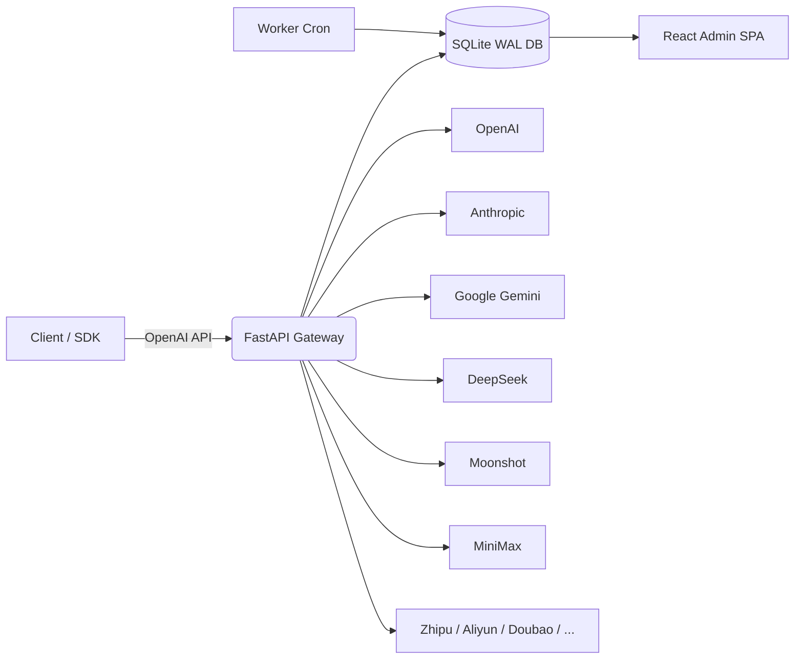
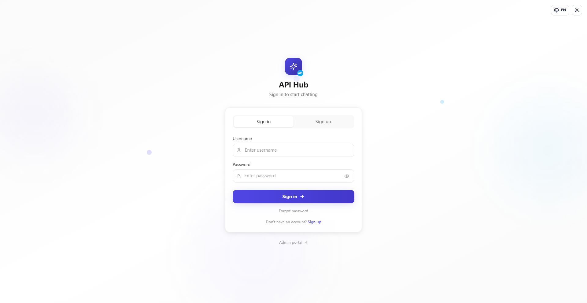
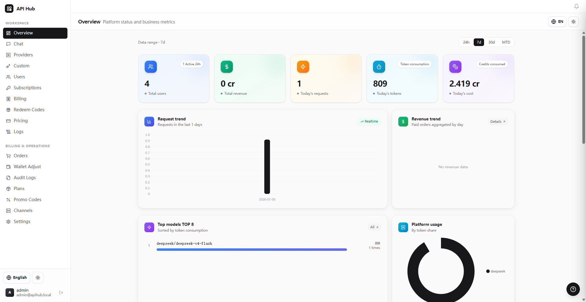
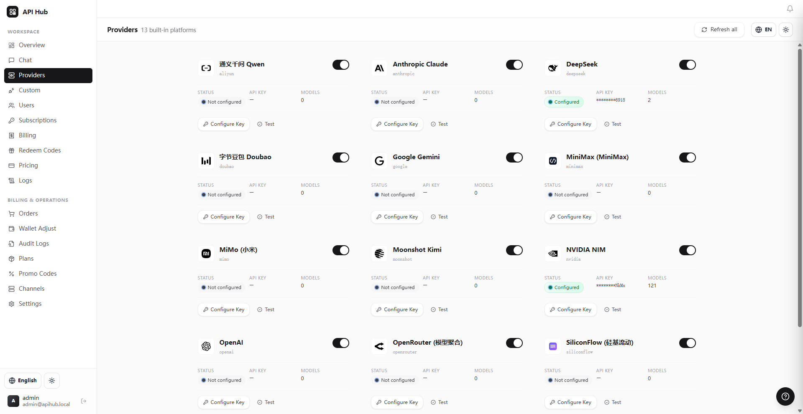
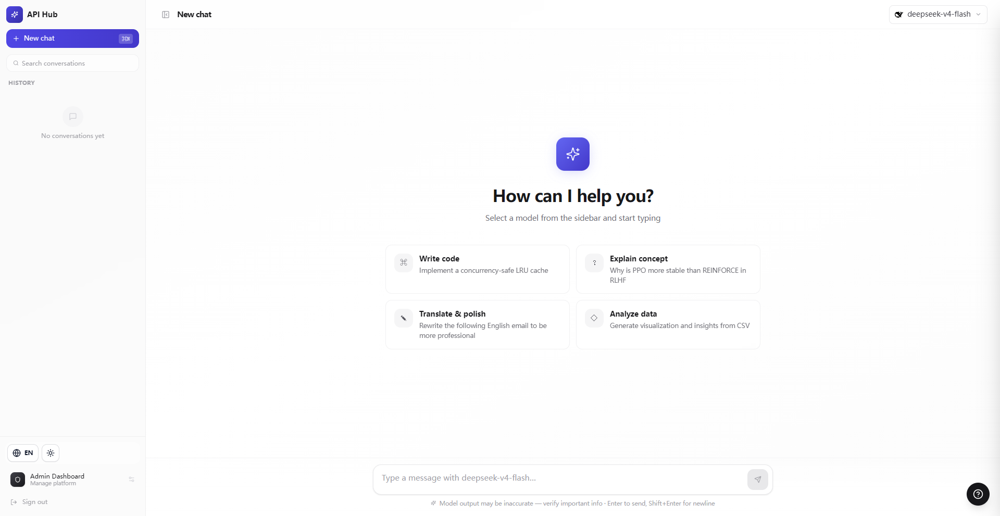

<div align="center">
  
  <h1>SyntropyBridge</h1>
  <p><strong>Unified OpenAI-compatible gateway for 13+ AI providers</strong></p>
  <p>One API key. Multiple models. Built-in billing, quotas and subscriptions.</p>

  <p>
    
    
    
    
    <a href="LICENSE"></a>
  </p>

  <p>
    <a href="README.md">English</a> •
    <a href="README_CN.md">中文</a> •
    <a href="#-quick-start">Quick Start</a> •
    <a href="#-deployment">Deploy</a>
  </p>
</div>

---

## 📑 Table of Contents

- [🌟 What is SyntropyBridge?](#-what-is-syntropybridge)
- [🎨 Features](#-features)
- [🏗️ Architecture](#-architecture)
- [📸 Screenshots](#-screenshots)
- [🛠️ Tech Stack](#-tech-stack)
- [⚡ Quick Start](#-quick-start)
- [⚙️ Configuration](#-configuration)
- [📖 API Usage](#-api-usage)
- [🚀 Deployment](#-deployment)
- [🔁 Background Workers](#-background-workers)
- [🔒 Security](#-security)
- [❓ FAQ](#-faq)
- [🗺️ Roadmap](#-roadmap)
- [🤝 Contributing](#-contributing)
- [📜 Changelog](#-changelog)
- [📄 License](#-license)
- [💬 Support](#-support)

---

## 🌟 What is SyntropyBridge?

**SyntropyBridge** is a multi-provider AI API gateway and monetization platform. It exposes a single **OpenAI-compatible `/v1/chat/completions`** endpoint and routes requests across 13+ upstream providers:

OpenAI, Anthropic Claude, Google Gemini, DeepSeek, Moonshot/Kimi, MiniMax, Zhipu GLM, Aliyun DashScope, ByteDance Doubao, NVIDIA NIM, OpenRouter, SiliconFlow, MiMo.

It is designed for operators who need:

- A unified API facade for multiple model vendors
- Per-user quotas, rate limits and monthly budgets
- Credit-based billing with Stripe and USDT (NOWPayments)
- Subscription plans, promo codes, redeem codes and audit logs
- A web admin dashboard for user, order and provider management

---

## 🎨 Features

### Gateway

- **13+ Provider Aggregation** via one OpenAI-compatible API
- **Streaming and non-streaming** `/v1/chat/completions` and `/v1/completions`
- **Custom Providers**: dynamically register any OpenAI-compatible endpoint with SSRF protection
- **Channel Key Rotation**: multiple keys per provider, weighted round-robin, automatic cooldown on failure
- **Circuit Breaker**: per-provider failure isolation (5-failure threshold, 30s cooldown)

### Access Control

- Session-cookie auth with CSRF protection
- API key authentication (`Authorization: Bearer ...` / `X-API-Key`)
- Per-user API tokens (`mmx_tk_*`) with model and IP restrictions
- Server-side sessions with sliding-window refresh and User-Agent binding
- Brute-force lockout after 8 failures in 15 minutes

### Billing

- **Credit System**: 1 CNY = 100 credits
- **Wallet Ledger**: atomic balance updates with transaction history
- **Subscription Plans**: free, basic, pro, team and enterprise tiers
- **Top-up Orders**: Stripe Checkout, USDT (NOWPayments) and admin manual grants
- **Promo and Redeem Codes**: discount, bonus, credits and plan-days campaigns
- **Optional Credit Expiration**: TTL on credit entries

### Quotas and Reliability

- 6-dimensional quota gate: 5-hour window, weekly, monthly, monthly budget, RPM, TPM
- Per-request token reservations to prevent concurrent over-spend
- SQLite-backed idempotency store (24h retention) for SDK retries
- Daily and hourly background workers for lifecycle, cleanup and reconciliation jobs

### Admin Dashboard

- React 18 + Vite + Tailwind SPA
- Role-based admin with super-admin gate
- Audit logs for sensitive operations
- Usage analytics: daily/monthly, by model/provider, top users, CSV export
- Provider health metrics: latency p50/p95, success rate
- In-app notifications and low-balance banner

---

## 🏗️ Architecture



### Request Flow

1. **Auth**: user is identified by session cookie or API key
2. **Quota**: `quota_service.assert_request_allowed()` checks 6-dimensional limits
3. **Reserve**: tokens are reserved from the wallet to prevent concurrent over-spend
4. **Route**: provider and channel are selected by weighted round-robin + health state
5. **Proxy**: request is forwarded upstream; streaming responses flow back via SSE
6. **Settle**: actual token usage is reconciled against the reservation; wallet is charged
7. **Log**: usage, cost and latency are recorded in `usage_logs` and rollups

> SQLite is intentionally chosen for cost-sensitive, single-node SaaS deployments. Run **one Uvicorn worker** to avoid database lock contention.

---

## 📸 Screenshots

| Login | Admin Dashboard | Providers | Chat |
|:-----:|:---------------:|:---------:|:----:|
|  |  |  |  |

---

## 🛠️ Tech Stack

| Layer | Technology |
|-------|------------|
| Backend | Python 3.10+, FastAPI, Uvicorn, SQLite (WAL) |
| Frontend | React 18, Vite 5, Tailwind CSS, Zustand, i18next |
| HTTP Client | httpx (async, connection pooling) |
| Crypto | cryptography (Fernet), PBKDF2-HMAC-SHA256 |
| Payments | Stripe, NOWPayments (USDT) |
| Deployment | Docker, Docker Compose, systemd, Nginx |
| Testing | pytest with temp SQLite DB |

---

## ⚡ Quick Start

### Option 1: Docker Compose (Recommended)

```bash
git clone https://github.com/Lab-sku/SyntropyBridge.git
cd SyntropyBridge

cp deploy/.env.production.example .env.production
# Edit .env.production: SECRET_KEY, ENCRYPTION_KEY, ADMIN_PASSWORD, provider keys

docker-compose up -d --build
```

Visit http://localhost:8000. If `ADMIN_PASSWORD` is set, log in directly; otherwise use the init wizard.

### Option 2: Local Development

```bash
# Backend
pip install -r requirements.txt
cp .env.example .env
# Edit .env
python -m uvicorn backend.main:app --host 0.0.0.0 --port 8000 --reload

# Frontend (in another terminal)
cd frontend
npm ci
npm run dev
```

### Option 3: One-Command Demo (no frontend build)

```bash
pip install -r requirements.txt
cp .env.example .env
# Edit .env
python -m uvicorn backend.main:app --host 0.0.0.0 --port 8000
```

If `frontend/dist/` exists, the backend serves the SPA; otherwise `/docs` still works.

---

## ⚙️ Configuration

Copy `.env.example` to `.env` (or `deploy/.env.production.example` to `.env.production`) and fill in the required values:

```bash
# Generate with secrets.token_urlsafe
SECRET_KEY=your-secret-key
ENCRYPTION_KEY=your-fernet-key

# Bootstrap admin (required unless using the init wizard)
ADMIN_USERNAME=admin
ADMIN_PASSWORD=your-strong-password

# At least one provider key
OPENAI_API_KEY=sk-...
DEEPSEEK_API_KEY=...
```

### Key Environment Variables

| Variable | Required | Description |
|----------|:--------:|-------------|
| `SECRET_KEY` | yes | JWT/session signing key |
| `ENCRYPTION_KEY` | yes | Fernet key for encrypting stored API keys |
| `ADMIN_USERNAME` | no | Bootstrap admin username |
| `ADMIN_PASSWORD` | no | Bootstrap admin password |
| `DATABASE_PATH` | no | SQLite path; defaults to `./minimax_proxy.db` |
| `CORS_ORIGINS` | yes* | Comma-separated allowed origins; must not be `*` in production |
| `STRIPE_SECRET_KEY` | no | Stripe payments |
| `NOWPAYMENTS_API_KEY` | no | USDT payments |

\* Required in production.

> Never commit `.env`, `*.db`, `*.log`, SSL certificates or files containing secrets. They are ignored by `.gitignore`.

---

## 📖 API Usage

Interactive docs are available at:

- Swagger UI: `http://localhost:8000/docs`
- ReDoc: `http://localhost:8000/redoc`

### Chat Completions

```bash
curl -X POST http://localhost:8000/v1/chat/completions \
  -H "Content-Type: application/json" \
  -H "Authorization: Bearer <user_api_key>" \
  -d '{
    "model": "gpt-4o",
    "messages": [{"role": "user", "content": "Hello!"}],
    "stream": false
  }'
```

### Streaming

```bash
curl -X POST http://localhost:8000/v1/chat/completions \
  -H "Content-Type: application/json" \
  -H "Authorization: Bearer <user_api_key>" \
  -d '{
    "model": "deepseek-chat",
    "messages": [{"role": "user", "content": "Hello!"}],
    "stream": true
  }'
```

### Admin Login

```bash
curl -X POST http://localhost:8000/api/admin/login \
  -H "Content-Type: application/json" \
  -d '{"username":"admin","password":"your-password"}'
```

### Force Provider Routing

Prefix a model with the provider name to force routing:

```json
{ "model": "openai/gpt-4o" }
{ "model": "anthropic/claude-3-5-sonnet" }
```

---

## 🚀 Deployment

See [`deploy/DEPLOYMENT.md`](deploy/DEPLOYMENT.md) for the full production runbook, including:

- systemd service + timer setup
- Nginx reverse proxy with SSE support
- SQLite backup script
- Permission-aware health probes

### Bare Metal Checklist

1. Copy `deploy/.env.production.example` to `.env.production`
2. Generate strong `SECRET_KEY` and `ENCRYPTION_KEY`
3. Restrict permissions: `chmod 600 .env.production`
4. Set `DATABASE_PATH` to `/var/lib/syntropybridge/data.db`
5. Run daily + hourly workers via systemd timers
6. Put Nginx in front for HTTPS and rate limiting

### Docker Compose

`docker-compose.yml` starts two services:

- `api`: the FastAPI application bound to `127.0.0.1:8000`
- `worker`: runs hourly jobs every hour and daily jobs once per day

The `api-data` Docker volume persists the SQLite database across container restarts. Expose the API via Nginx for public access.

---

## 🔁 Background Workers

| Worker | Frequency | Responsibilities |
|--------|-----------|------------------|
| Daily | Once per day | Subscription expiry/renewal, soft-delete purge, credits sweep, Stripe/USDT reconciliation |
| Hourly | Every hour | Expired orders, pending payments, upcoming renewals, reservation TTL sweep |

Run manually:

```bash
python -c "from backend.services.subscription_service import SubscriptionService; SubscriptionService.run_daily_jobs()"
python -c "from backend.services.subscription_service import SubscriptionService; SubscriptionService.run_hourly_jobs()"
```

---

## 🔒 Security

- CSRF triple-compare on all state-changing billing endpoints
- IDOR protection on subscription lifecycle endpoints
- API key reveal gated behind super-admin role
- HMAC webhook signature verification for Stripe and USDT
- Server-side session binding to User-Agent
- Password policy: 12+ characters, 3 of 4 character classes
- Brute-force lockout after 8 failures in 15 minutes
- API keys and provider keys encrypted at rest with Fernet
- Log redaction for secrets, JWTs, emails and PII

For responsible disclosure, email sliocben@gmail.com.

---

## ❓ FAQ

**Q: Does it support multiple Uvicorn workers?**  
A: No. SQLite single-writer semantics require one worker. Scale vertically or switch to PostgreSQL if you need horizontal scaling.

**Q: How do I add a new provider?**  
A: If it is OpenAI-compatible, add it via Admin → Custom Providers. For non-standard APIs, implement a provider class in `backend/providers/` and register it in `backend/providers/base.py` (or import it in `backend/providers/__init__.py`).

**Q: What happens if a provider fails?**  
A: The failed channel enters cooldown; traffic is rerouted to healthy channels. If all channels fail, a structured 502/503 error is returned.

**Q: Can I disable payments and use it as a free internal proxy?**  
A: Yes. Leave Stripe and NOWPayments keys unset and use admin wallet adjustments or free subscription plans.

**Q: Is the database encrypted?**  
A: Provider keys stored in the DB are encrypted with Fernet. The SQLite file itself is not encrypted; use filesystem-level encryption (e.g., LUKS) for that.

---

## 🗺️ Roadmap

- [x] Multi-provider OpenAI-compatible gateway
- [x] Credit wallet + Stripe + USDT payments
- [x] Subscription lifecycle management
- [x] Admin dashboard with audit logs
- [x] Channel rotation and circuit breaker
- [ ] Real-time usage WebSocket dashboard
- [ ] Grafana/Prometheus metrics exporter
- [ ] OpenID Connect / SSO integration
- [ ] PostgreSQL backend adapter

---

## 🤝 Contributing

1. Fork the repository
2. Create a feature branch: `git checkout -b feature/amazing-feature`
3. Run tests: `pytest backend/tests/`
4. Build frontend: `cd frontend && npm run build`
5. Commit with clear messages
6. Open a Pull Request

See [CONTRIBUTING.md](CONTRIBUTING.md) for details.

---

## 📜 Changelog

See [CHANGELOG.md](CHANGELOG.md).

---

## 📄 License

This project is licensed under the [MIT License](LICENSE).

---

## 💬 Support

📧 sliocben@gmail.com
