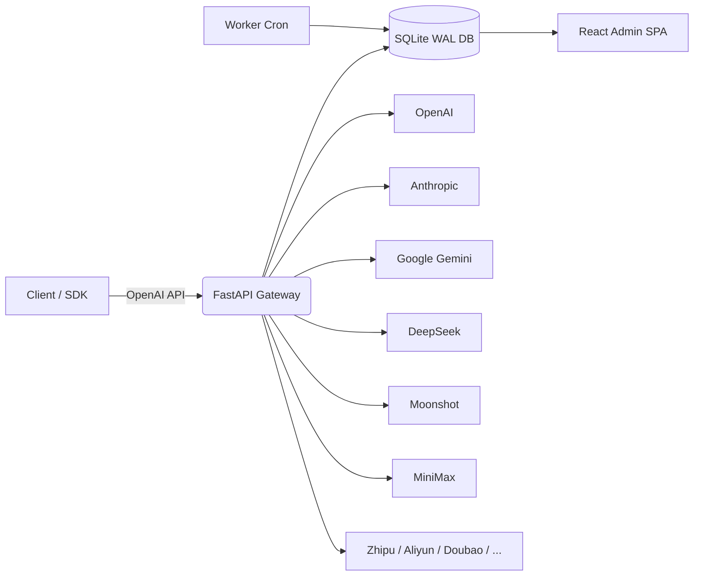

<div align="center">
  
  <h1>SyntropyBridge</h1>
  <p><strong>Unified OpenAI-compatible gateway for 13+ AI providers</strong></p>
  <p>One API key. Multiple models. Built-in billing, quotas & subscriptions.</p>

  <p>
    
    
    
    
    
  </p>

  <p>
    <a href="README.md">English</a> •
    <a href="README_CN.md">中文</a> •
    <a href="#-table-of-contents">Docs</a> •
    <a href="#-quick-start">Quick Start</a> •
    <a href="#-deployment">Deploy</a>
  </p>
</div>

---

## 📑 Table of Contents

- [🌟 What is SyntropyBridge?](#-what-is-syntropybridge)
- [✨ Why SyntropyBridge?](#-why-syntropybridge)
- [🎨 Features](#-features)
- [🏗️ Architecture](#-architecture)
- [📸 Screenshots](#-screenshots)
- [🛠️ Tech Stack](#-tech-stack)
- [⚡ Quick Start](#-quick-start)
- [⚙️ Configuration](#-configuration)
- [📖 API Usage](#-api-usage)
- [🚀 Deployment](#-deployment)
- [🔁 Background Workers](#-background-workers)
- [🔒 Security](#-security)
- [❓ FAQ](#-faq)
- [🗺️ Roadmap](#-roadmap)
- [🤝 Contributing](#-contributing)
- [📜 Changelog](#-changelog)
- [📄 License](#-license)
- [🙏 Acknowledgments](#-acknowledgments)
- [⭐ Star History](#-star-history)
- [👥 Contributors](#-contributors)
- [💬 Support](#-support)

---

## 🌟 What is SyntropyBridge?

**SyntropyBridge** is a production-ready, multi-provider AI API relay and monetization platform. It exposes a single **OpenAI-compatible `/v1/chat/completions`** endpoint while routing requests across 13+ upstream model providers, including OpenAI, Anthropic Claude, Google Gemini, DeepSeek, Moonshot/Kimi, MiniMax, Zhipu GLM, Aliyun DashScope, ByteDance Doubao, NVIDIA NIM, OpenRouter, SiliconFlow, and MiMo.

Originally built as a MiniMax proxy, it has evolved into a full-stack SaaS toolkit for operators who want to:

- Resell or internally govern AI model access
- Enforce per-user quotas, budgets, and rate limits
- Charge users via a credit wallet with Stripe and USDT (NOWPayments) integration
- Manage subscriptions, promo codes, redeem codes, and audit logs from a web dashboard

Whether you are running a small team AI hub or a public API platform, SyntropyBridge gives you the routing, billing, and observability layers out of the box.

---

## ✨ Why SyntropyBridge?

| Pain Point | How SyntropyBridge Solves It |
|-------------|-------------------------------|
| Every provider has a different API | One OpenAI-compatible gateway for all models |
| Hard to bill users per token | Credit wallet + per-request cost tracking |
| No quota/budget control | 6-dimensional quota gate (5h/week/month/RPM/TPM/budget) |
| Single point of failure | Weighted channel rotation + circuit breaker + fallback |
| Webhook delivery is unreliable | Daily reconciliation jobs for Stripe & USDT |
| No admin visibility | Web dashboard for users, orders, providers, pricing, and audit logs |

### Feature Comparison

| Capability | SyntropyBridge | OneAPI | New API | Custom Reverse Proxy |
|------------|:------------:|:------:|:-------:|:--------------------:|
| OpenAI-compatible gateway | ✅ | ✅ | ✅ | ⚠️ partial |
| 13+ built-in providers | ✅ | ✅ | ✅ | ❌ |
| Per-user quota (6 dims) | ✅ | ⚠️ | ⚠️ | ❌ |
| Credit wallet & billing | ✅ | ⚠️ | ⚠️ | ❌ |
| Stripe + USDT payments | ✅ | ⚠️ | ❌ | ❌ |
| Subscription lifecycle | ✅ | ⚠️ | ❌ | ❌ |
| Web admin dashboard | ✅ | ✅ | ⚠️ | ❌ |
| Audit logs | ✅ | ⚠️ | ❌ | ❌ |
| Circuit breaker & channel rotation | ✅ | ✅ | ⚠️ | ❌ |
| Self-hosted / single binary | ✅ | ✅ | ✅ | ⚠️ |

> ⚠️ indicates partial support or requires extra configuration.

---

## 🎨 Features

### Core Gateway

- **13+ Provider Aggregation**: OpenAI, Anthropic, Google, MiniMax, DeepSeek, Moonshot, Zhipu, Aliyun, Doubao, NVIDIA, OpenRouter, SiliconFlow, MiMo
- **OpenAI-Compatible API**: `/v1/models`, `/v1/chat/completions`, `/v1/completions` (streaming + non-streaming)
- **Custom Providers**: Dynamically register any OpenAI-compatible endpoint with SSRF protection
- **Channel Key Rotation**: Multiple keys per provider, weighted round-robin, automatic cooldown on failure
- **Circuit Breaker**: Per-provider failure isolation (5-failure threshold, 30s cooldown)

### User & Access Control

- Session-cookie auth with CSRF protection
- API key authentication (`Authorization: Bearer ...` / `X-API-Key`)
- Per-user API tokens (`mmx_tk_*`) with model/IP restrictions
- Server-side sessions with sliding-window refresh and UA binding
- Brute-force lockout protection

### Billing & Monetization

- **Credit System**: 1 CNY = 100 credits (roughly 1 USD ~ 700 credits)
- **Wallet Ledger**: Atomic balance updates with transaction history
- **Subscription Plans**: free/basic/pro/team/enterprise tiers with monthly credits
- **Top-up Orders**: Stripe Checkout + USDT (NOWPayments) + admin manual grants
- **Promo & Redeem Codes**: Discount/bonus/credits/plan-days campaigns
- **Per-Credit Expiration**: Optional TTL on credit entries

### Quotas & Reliability

- 6-dimensional quota gate: 5h window, weekly, monthly, monthly budget, RPM, TPM
- Per-request token reservations to prevent concurrent double-spend
- SQLite-backed idempotency store (24h retention) for SDK retries
- Daily/hourly background workers for subscription lifecycle, credits sweep, reservation TTL, and reconciliation

### Admin & Observability

- React 18 + Vite + Tailwind admin dashboard
- Role-based admin with super-admin gate
- Audit logs for every sensitive operation
- Usage analytics: daily/monthly, by model/provider, top users, CSV export
- Provider health metrics: latency p50/p95, success rate
- In-app notifications and low-balance banners

---

## 🏗️ Architecture



### Request Flow

1. **Auth**: Request hits FastAPI; user is identified by session cookie or API key
2. **Quota**: `quota_service.assert_request_allowed()` checks 6-dimensional limits
3. **Reserve**: Tokens are reserved from the wallet to prevent concurrent over-spend
4. **Route**: Provider/channel is selected by weighted round-robin + health state
5. **Proxy**: Request is forwarded upstream; streaming responses flow back via SSE
6. **Settle**: Actual token usage is reconciled against the reservation; wallet is charged
7. **Log**: Usage, cost, and latency are recorded in `usage_logs` and rollups

> SQLite is intentionally chosen for cost-sensitive, single-node SaaS deployments. The architecture assumes **one Uvicorn worker** to avoid database lock contention.

---

## 📸 Screenshots

> 📷 **We need your help!** If you deploy SyntropyBridge, please consider contributing screenshots. Place them in `docs/screenshots/` and open a PR.

| Admin Dashboard | User Wallet | Provider Health |
|:---------------:|:-----------:|:---------------:|
|  |  |  |
| *Manage users, orders, subscriptions and providers* | *Top-up, transactions, auto-recharge* | *Latency, success rate, channel status* |

---

## 🛠️ Tech Stack

| Layer | Technology |
|-------|------------|
| Backend | Python 3.10+, FastAPI, Uvicorn, SQLite (WAL) |
| Frontend | React 18, Vite 5, Tailwind CSS, Zustand, i18next |
| HTTP Client | httpx (async, connection pooling) |
| Crypto | cryptography (Fernet), PBKDF2-HMAC-SHA256 |
| Payments | Stripe, NOWPayments (USDT) |
| Deployment | Docker, Docker Compose, systemd, Nginx |
| Testing | pytest, temp SQLite DB |

---

## ⚡ Quick Start

### Option 1: Docker Compose (Recommended)

```bash
# 1. Clone
git clone https://github.com/YOUR_USERNAME/YOUR_REPO_NAME.git
cd YOUR_REPO_NAME

# 2. Configure production environment
cp deploy/.env.production.example .env.production
# Edit .env.production and fill SECRET_KEY, ENCRYPTION_KEY, ADMIN_PASSWORD, provider keys

# 3. Build and start everything
docker-compose up -d --build

# 4. Visit http://localhost:8000
#    If ADMIN_PASSWORD is set, login directly. Otherwise create admin via the init wizard.
```

### Option 2: Local Development

```bash
# 1. Install Python dependencies
pip install -r requirements.txt

# 2. Install frontend dependencies and build
cd frontend
npm ci
npm run build
cd ..

# 3. Configure environment
cp .env.example .env
# Edit .env

# 4. Start backend with auto-reload
python -m uvicorn backend.main:app --host 0.0.0.0 --port 8000 --reload

# 5. Or simply double-click start.bat on Windows
```

### Option 3: One-Command Demo (no build)

```bash
pip install -r requirements.txt
cp .env.example .env
# fill .env
python -m uvicorn backend.main:app --host 0.0.0.0 --port 8000
```

The backend will serve the SPA from `frontend/dist/` if it exists; otherwise the API docs at `/docs` still work.

---

## ⚙️ Configuration

Copy `.env.example` to `.env` (or `deploy/.env.production.example` to `.env.production`) and fill in the required values:

```bash
# Security (generate with secrets.token_urlsafe)
SECRET_KEY=your-secret-key
ENCRYPTION_KEY=your-fernet-key

# Admin bootstrap
ADMIN_USERNAME=admin
ADMIN_PASSWORD=your-strong-password

# At least one provider key
OPENAI_API_KEY=sk-...
DEEPSEEK_API_KEY=...
```

### Key Environment Variables

| Variable | Required | Description |
|----------|:--------:|-------------|
| `SECRET_KEY` | ✅ | JWT/session signing key |
| `ENCRYPTION_KEY` | ✅ | Fernet key for encrypting stored API keys |
| `ADMIN_USERNAME` | ⚠️ | Bootstrap admin username (optional if using UI wizard) |
| `ADMIN_PASSWORD` | ⚠️ | Bootstrap admin password (optional if using UI wizard) |
| `DATABASE_PATH` | ❌ | SQLite path; defaults to `./minimax_proxy.db` |
| `CORS_ORIGINS` | ⚠️ | Comma-separated allowed origins; must not be `*` in production |
| `STRIPE_SECRET_KEY` | ❌ | For Stripe payments |
| `NOWPAYMENTS_API_KEY` | ❌ | For USDT payments |

> **Never commit `.env`, `*.db`, `*.log`, SSL certificates, or any file containing secrets.** They are already ignored by `.gitignore`.

---

## 📖 API Usage

Once running, interactive docs are available at:

- Swagger UI: `http://localhost:8000/docs`
- ReDoc: `http://localhost:8000/redoc`

### Chat Completions

```bash
curl -X POST http://localhost:8000/v1/chat/completions \
  -H "Content-Type: application/json" \
  -H "Authorization: Bearer <user_api_key>" \
  -d '{
    "model": "gpt-4o",
    "messages": [{"role": "user", "content": "Hello!"}],
    "stream": false
  }'
```

### Streaming

```bash
curl -X POST http://localhost:8000/v1/chat/completions \
  -H "Content-Type: application/json" \
  -H "Authorization: Bearer <user_api_key>" \
  -d '{
    "model": "deepseek-chat",
    "messages": [{"role": "user", "content": "Hello!"}],
    "stream": true
  }'
```

### Admin Login

```bash
curl -X POST http://localhost:8000/api/admin/login \
  -H "Content-Type: application/json" \
  -d '{"username":"admin","password":"your-password"}'
```

### Model Prefixes

You can prefix models with the provider name to force routing:

```json
{ "model": "openai/gpt-4o" }
{ "model": "anthropic/claude-3-5-sonnet" }
```

---

## 🚀 Deployment

See [`deploy/DEPLOYMENT.md`](deploy/DEPLOYMENT.md) for the full production runbook, including:

- systemd service + timer setup
- Nginx reverse proxy with SSE support
- SQLite backup script
- Permission-aware health probes

### Bare Metal Quick Checklist

1. Copy `deploy/.env.production.example` to `.env.production`
2. Generate strong `SECRET_KEY` and `ENCRYPTION_KEY`
3. Restrict `.env.production` permissions: `chmod 600 .env.production`
4. Point `DATABASE_PATH` to `/var/lib/syntropybridge/data.db`
5. Run daily + hourly workers via systemd timers
6. Put Nginx in front for HTTPS and rate limiting

### Docker Production Notes

- The included `docker-compose.yml` binds the API to `127.0.0.1:8000`; expose it via Nginx for public access
- `api-data` Docker volume persists the SQLite database across container restarts
- Worker container runs hourly jobs in a loop

---

## 🔁 Background Workers

| Worker | Frequency | Responsibilities |
|--------|-----------|------------------|
| Daily | Once per day | Subscription expiry/renewal, soft-delete purge, credits sweep, Stripe/USDT reconciliation |
| Hourly | Every hour | Expired orders, pending payments, upcoming renewals, reservation TTL sweep |

Run manually:

```bash
python -c "from backend.services.subscription_service import SubscriptionService; SubscriptionService.run_daily_jobs()"
python -c "from backend.services.subscription_service import SubscriptionService; SubscriptionService.run_hourly_jobs()"
```

---

## 🔒 Security

SyntropyBridge has been through multiple security audits (Phase 1/2/3). Highlights:

- CSRF triple-compare on all state-changing billing endpoints
- IDOR protection on subscription lifecycle endpoints
- Super-admin gate on API key reveal
- HMAC webhook signature verification for Stripe and USDT
- Server-side session binding to User-Agent
- Password policy: 12+ chars, 3 of 4 character classes
- Brute-force lockout after 8 failures in 15 minutes
- API keys and provider keys encrypted at rest with Fernet
- Log redaction for secrets, emails, and PII

For responsible disclosure, please email security@your-domain.com or open a private GitHub Security Advisory.

---

## ❓ FAQ

**Q: Can I use SyntropyBridge without any code changes?**  
A: Yes. Configure `.env` with at least one provider key and run `python -m uvicorn backend.main:app`.

**Q: Does it support multiple workers?**  
A: No. SQLite single-writer semantics require one Uvicorn worker. Scale vertically or switch to PostgreSQL if you need horizontal scaling.

**Q: How do I add a new provider?**  
A: If it is OpenAI-compatible, add it via Admin → Custom Providers. For non-standard APIs, implement a provider class in `backend/providers/` and register it with `ProviderRegistry` in `backend/providers/base.py` (or import it in `backend/providers/__init__.py`).

**Q: What happens if a provider fails?**  
A: The failed channel enters cooldown; traffic is rerouted to healthy channels. If all channels fail, a 502/503 is returned with a structured error.

**Q: Can I disable payments and use it as a free internal proxy?**  
A: Yes. Leave Stripe and NOWPayments keys unset and use admin wallet adjustments / free subscription plans.

**Q: Is the database encrypted?**  
A: Provider keys stored in the DB are encrypted with Fernet. The SQLite file itself is not encrypted; use filesystem-level encryption (e.g., LUKS) for that.

---

## 🗺️ Roadmap

- [x] Multi-provider OpenAI-compatible gateway
- [x] Credit wallet + Stripe + USDT payments
- [x] Subscription lifecycle (upgrade/downgrade/cancel/renew)
- [x] Admin dashboard with audit logs
- [x] Channel rotation and circuit breaker
- [ ] Real-time usage WebSocket dashboard
- [ ] Multi-language model fine-tuning marketplace
- [ ] Grafana/Prometheus metrics exporter
- [ ] OpenID Connect / SSO integration
- [ ] Multi-region deployment guide
- [ ] PostgreSQL backend adapter

Have a feature request? Open a GitHub Issue or Discussion.

---

## 🤝 Contributing

Contributions are welcome! Please:

1. Fork the repository
2. Create a feature branch (`git checkout -b feature/amazing-feature`)
3. Run tests: `pytest backend/tests/`
4. Build frontend: `cd frontend && npm run build`
5. Commit with clear messages
6. Open a Pull Request

Please read [CONTRIBUTING.md](CONTRIBUTING.md) for detailed guidelines.

---

## 📜 Changelog

See [CHANGELOG.md](CHANGELOG.md) for a detailed history of changes.

---

## 📄 License

This project is licensed under the MIT License — see the [LICENSE](LICENSE) file for details.

---

## 🙏 Acknowledgments

- Built with [FastAPI](https://fastapi.tiangolo.com/) and [React](https://react.dev/)
- Provider logos are trademarks of their respective owners

---

## ⭐ Star History

[](https://star-history.com/#YOUR_USERNAME/YOUR_REPO_NAME&Date)

> Replace `YOUR_USERNAME/YOUR_REPO_NAME` with your actual repository path after the first stars arrive.

---

## 👥 Contributors

Thanks to everyone who has contributed to SyntropyBridge!

<a href="https://github.com/YOUR_USERNAME/YOUR_REPO_NAME/graphs/contributors">
  
</a>

> Replace `YOUR_USERNAME/YOUR_REPO_NAME` with your actual repository path.

---

## 💬 Support

- 📧 Email: contact@your-domain.com
- 💬 Discussions: [GitHub Discussions](https://github.com/YOUR_USERNAME/YOUR_REPO_NAME/discussions)
- 🐛 Issues: [GitHub Issues](https://github.com/YOUR_USERNAME/YOUR_REPO_NAME/issues)

<div align="center">
  <p>If you find SyntropyBridge helpful, please consider giving us a ⭐ on GitHub!</p>
</div>
