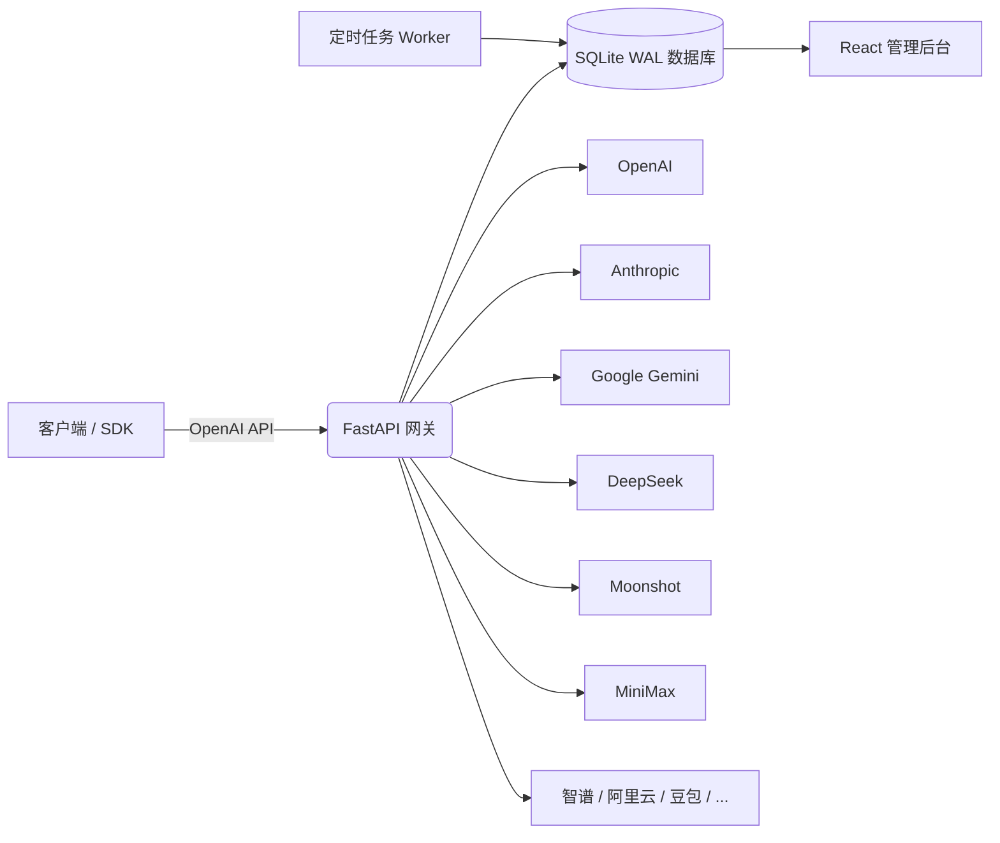

<div align="center">
  
  <h1>SyntropyBridge</h1>
  <p><strong>13+ AI 供应商统一的 OpenAI 兼容网关</strong></p>
  <p>一个 API Key，对接多个模型；内置计费、配额与订阅管理。</p>

  <p>
    
    
    
    
    
  </p>

  <p>
    <a href="README.md">English</a> •
    <a href="#中文文档目录">文档目录</a> •
    <a href="#-快速开始">快速开始</a> •
    <a href="#-部署指南">部署</a>
  </p>
</div>

---

## 中文文档目录

- [🌟 项目简介](#-项目简介)
- [✨ 为什么选择 SyntropyBridge？](#-为什么选择-syntropybridge)
- [🎨 核心特性](#-核心特性)
- [🏗️ 系统架构](#-系统架构)
- [📸 界面预览](#-界面预览)
- [🛠️ 技术栈](#-技术栈)
- [⚡ 快速开始](#-快速开始)
- [⚙️ 配置说明](#-配置说明)
- [📖 API 使用](#-api-使用)
- [🚀 部署指南](#-部署指南)
- [🔁 后台任务](#-后台任务)
- [🔒 安全](#-安全)
- [❓ 常见问题](#-常见问题)
- [🗺️ 路线图](#-路线图)
- [🤝 贡献指南](#-贡献指南)
- [📜 更新日志](#-更新日志)
- [📄 开源协议](#-开源协议)
- [🙏 致谢](#-致谢)
- [⭐ Star 历史](#-star-历史)
- [👥 贡献者](#-贡献者)
- [💬 支持](#-支持)

---

## 🌟 项目简介

**SyntropyBridge** 是一个生产级的多供应商 AI API 中转与商业化平台。它对外暴露统一的 **OpenAI 兼容 `/v1/chat/completions`** 接口，后端自动路由到 13+ 家上游模型供应商，包括 OpenAI、Anthropic Claude、Google Gemini、DeepSeek、Moonshot/Kimi、MiniMax、智谱 GLM、阿里云 DashScope、字节豆包、NVIDIA NIM、OpenRouter、SiliconFlow、MiMo。

项目最初是一个 MiniMax 代理，现已发展为完整的一站式 SaaS 工具，适合以下场景：

- 对外转售 AI 模型 API 能力
- 企业内部统一管理和计费 AI 调用
- 按用户/团队设置配额、预算、速率限制
- 通过 Stripe、USDT（NOWPayments）充值积分，管理订阅、兑换码、审计日志

无论你是运营一个小型团队 AI 门户，还是公开 API 平台，SyntropyBridge 都能提供开箱即用的路由、计费和可观测能力。

---

## ✨ 为什么选择 SyntropyBridge？

| 痛点 | SyntropyBridge 的解决方案 |
|------|---------------------------|
| 每家厂商 API 不统一 | 一个 OpenAI 兼容网关对接所有模型 |
| 难以按 token 计费 | 积分钱包 + 每次请求成本追踪 |
| 缺少配额/预算控制 | 6 维配额门控（5小时/周/月/RPM/TPM/预算） |
| 单点故障风险 | 加权渠道轮询 + 熔断器 + 自动降级 |
| Webhook 可能丢消息 | Stripe / USDT 每日对账任务 |
| 缺少管理可视化 | Web 后台管理用户、订单、渠道、定价、审计日志 |

### 功能对比

| 能力 | SyntropyBridge | OneAPI | New API | 自建反向代理 |
|------|:------------:|:------:|:-------:|:----------:|
| OpenAI 兼容网关 | ✅ | ✅ | ✅ | ⚠️ 部分 |
| 13+ 内置供应商 | ✅ | ✅ | ✅ | ❌ |
| 按用户配额（6 维） | ✅ | ⚠️ | ⚠️ | ❌ |
| 积分钱包与计费 | ✅ | ⚠️ | ⚠️ | ❌ |
| Stripe + USDT 支付 | ✅ | ⚠️ | ❌ | ❌ |
| 订阅生命周期 | ✅ | ⚠️ | ❌ | ❌ |
| Web 管理后台 | ✅ | ✅ | ⚠️ | ❌ |
| 审计日志 | ✅ | ⚠️ | ❌ | ❌ |
| 熔断器与渠道轮询 | ✅ | ✅ | ⚠️ | ❌ |
| 自托管 / 单文件部署 | ✅ | ✅ | ✅ | ⚠️ |

> ⚠️ 表示部分支持或需要额外配置。

---

## 🎨 核心特性

### 统一网关

- **13+ 模型供应商聚合**：OpenAI、Anthropic、Google、MiniMax、DeepSeek、Moonshot、智谱、阿里云、豆包、NVIDIA、OpenRouter、SiliconFlow、MiMo
- **OpenAI 兼容 API**：`/v1/models`、`/v1/chat/completions`、`/v1/completions`（流式 + 非流式）
- **自定义 Provider**：动态注册任意 OpenAI 兼容端点，内置 SSRF 防护
- **渠道密钥轮询**：每个供应商支持多密钥，加权选择，失败自动冷却
- **熔断器**：按供应商隔离故障（5 次失败阈值，30 秒冷却）

### 用户与权限

- 基于 Session Cookie 的身份验证 + CSRF 防护
- API Key 认证（`Authorization: Bearer ...` / `X-API-Key`）
- 用户级 API Token（`mmx_tk_*`）支持模型/IP 限制
- 服务端 Session 滑动刷新 + UA 绑定
- 暴力破解锁定保护

### 计费与商业化

- **积分体系**：1 元人民币 = 100 积分（约 1 美元 ~ 700 积分）
- **钱包账本**：原子化余额更新 + 交易历史
- **订阅套餐**：免费版/基础版/专业版/团队版/企业版，含月度积分
- **充值订单**：Stripe Checkout + USDT（NOWPayments）+ 管理员手动赠金
- **优惠码与兑换码**：折扣/赠金/积分/套餐天数活动
- **积分过期**：支持为积分条目设置 TTL

### 配额与可靠性

- 6 维配额门控：5 小时窗口、周、月、月度预算、RPM、TPM
- 每次请求的 token 预留机制，防止并发超刷
- SQLite 幂等存储（24 小时保留），防止 SDK 重试重复扣费
- 日/小时后台任务：订阅生命周期、积分过期清理、预留 TTL、对账

### 后台与可观测性

- React 18 + Vite + Tailwind 管理后台
- 基于角色的管理员 + 超级管理员权限门控
- 敏感操作审计日志
- 用量分析：日/月统计、按模型/供应商、Top 用户、CSV 导出
- 供应商健康指标：p50/p95 延迟、成功率
- 应用内通知与低余额横幅

---

## 🏗️ 系统架构



### 请求流程

1. **认证**：请求进入 FastAPI，通过 Cookie 或 API Key 识别用户
2. **配额**：`quota_service.assert_request_allowed()` 检查 6 维限制
3. **预留**：从钱包预留 token，防止并发超刷
4. **路由**：按加权轮询 + 健康状态选择渠道
5. **代理**：转发上游请求；流式响应通过 SSE 返回
6. **结算**：按实际用量 reconcile 预留金额，扣减钱包
7. **记录**：用量、成本、延迟写入 `usage_logs` 和汇总表

> 特意选择 SQLite 用于成本敏感的单节点 SaaS 场景。为避免数据库锁争用，架构要求 **单 Uvicorn worker** 运行。

---

## 📸 界面预览

> 📷 **我们需要你的帮助！** 如果你部署了 SyntropyBridge，欢迎贡献截图。请将图片放入 `docs/screenshots/` 并提交 PR。

| 管理后台 | 用户钱包 | 供应商健康 |
|:-------:|:-------:|:---------:|
|  |  |  |
| *管理用户、订单、订阅和供应商* | *充值、交易、自动续费* | *延迟、成功率、渠道状态* |

---

## 🛠️ 技术栈

| 层级 | 技术 |
|------|------|
| 后端 | Python 3.10+, FastAPI, Uvicorn, SQLite (WAL) |
| 前端 | React 18, Vite 5, Tailwind CSS, Zustand, i18next |
| HTTP 客户端 | httpx（异步连接池） |
| 加密 | cryptography (Fernet), PBKDF2-HMAC-SHA256 |
| 支付 | Stripe, NOWPayments (USDT) |
| 部署 | Docker, Docker Compose, systemd, Nginx |
| 测试 | pytest, 临时 SQLite 数据库 |

---

## ⚡ 快速开始

### 方式一：Docker Compose（推荐）

```bash
# 1. 克隆仓库
git clone https://github.com/Lab-sku/SyntropyBridge.git
cd YOUR_REPO_NAME

# 2. 配置生产环境变量
cp deploy/.env.production.example .env.production
# 编辑 .env.production，填写 SECRET_KEY、ENCRYPTION_KEY、ADMIN_PASSWORD、供应商密钥

# 3. 构建并一键启动
docker-compose up -d --build

# 4. 访问 http://localhost:8000
#    如果设置了 ADMIN_PASSWORD，直接登录；否则通过初始化向导创建管理员
```

### 方式二：本地开发

```bash
# 1. 安装 Python 依赖
pip install -r requirements.txt

# 2. 安装前端依赖并构建
cd frontend
npm ci
npm run build
cd ..

# 3. 配置环境变量
cp .env.example .env
# 编辑 .env

# 4. 启动后端（热重载）
python -m uvicorn backend.main:app --host 0.0.0.0 --port 8000 --reload

# 5. Windows 用户也可以直接双击 start.bat
```

### 方式三：一键演示（不构建前端）

```bash
pip install -r requirements.txt
cp .env.example .env
# 填写 .env
python -m uvicorn backend.main:app --host 0.0.0.0 --port 8000
```

如果 `frontend/dist/` 存在，后端会提供 SPA；否则仍可访问 `/docs` API 文档。

---

## ⚙️ 配置说明

复制 `.env.example` 为 `.env`（或 `deploy/.env.production.example` 为 `.env.production`），然后填写必填项：

```bash
# 安全密钥（用 secrets.token_urlsafe 生成）
SECRET_KEY=your-secret-key
ENCRYPTION_KEY=your-fernet-key

# 管理员初始账号
ADMIN_USERNAME=admin
ADMIN_PASSWORD=your-strong-password

# 至少配置一个供应商密钥
OPENAI_API_KEY=sk-...
DEEPSEEK_API_KEY=...
```

### 关键环境变量

| 变量 | 必填 | 说明 |
|------|:--:|------|
| `SECRET_KEY` | ✅ | JWT/Session 签名密钥 |
| `ENCRYPTION_KEY` | ✅ | 加密存储 API Key 的 Fernet 密钥 |
| `ADMIN_USERNAME` | ⚠️ | 初始管理员用户名（如用 UI 向导可省略） |
| `ADMIN_PASSWORD` | ⚠️ | 初始管理员密码（如用 UI 向导可省略） |
| `DATABASE_PATH` | ❌ | SQLite 路径；默认 `./minimax_proxy.db` |
| `CORS_ORIGINS` | ⚠️ | 允许来源，生产环境不能为 `*` |
| `STRIPE_SECRET_KEY` | ❌ | Stripe 支付 |
| `NOWPAYMENTS_API_KEY` | ❌ | USDT 支付 |

> **切勿提交 `.env`、`*.db`、`*.log`、SSL 证书或任何包含密钥的文件。** 它们已被 `.gitignore` 排除。

---

## 📖 API 使用

服务启动后，可访问交互式文档：

- Swagger UI: `http://localhost:8000/docs`
- ReDoc: `http://localhost:8000/redoc`

### 聊天补全

```bash
curl -X POST http://localhost:8000/v1/chat/completions \
  -H "Content-Type: application/json" \
  -H "Authorization: Bearer <用户_API_Key>" \
  -d '{
    "model": "gpt-4o",
    "messages": [{"role": "user", "content": "你好！"}],
    "stream": false
  }'
```

### 流式响应

```bash
curl -X POST http://localhost:8000/v1/chat/completions \
  -H "Content-Type: application/json" \
  -H "Authorization: Bearer <用户_API_Key>" \
  -d '{
    "model": "deepseek-chat",
    "messages": [{"role": "user", "content": "你好！"}],
    "stream": true
  }'
```

### 管理员登录

```bash
curl -X POST http://localhost:8000/api/admin/login \
  -H "Content-Type: application/json" \
  -d '{"username":"admin","password":"你的密码"}'
```

### 模型前缀强制路由

可通过供应商前缀强制指定路由：

```json
{ "model": "openai/gpt-4o" }
{ "model": "anthropic/claude-3-5-sonnet" }
```

---

## 🚀 部署指南

详见 [`deploy/DEPLOYMENT.md`](deploy/DEPLOYMENT.md)，包含：

- systemd 服务 + 定时任务配置
- Nginx 反向代理（支持 SSE）
- SQLite 备份脚本
- 权限感知的健康检查探针

### 裸机部署速查

1. 复制 `deploy/.env.production.example` 为 `.env.production`
2. 生成强 `SECRET_KEY` 和 `ENCRYPTION_KEY`
3. 限制配置文件权限：`chmod 600 .env.production`
4. 将 `DATABASE_PATH` 指向 `/var/lib/syntropybridge/data.db`
5. 通过 systemd timer 运行日/小时任务
6. 前置 Nginx 提供 HTTPS 和限流

### Docker 生产注意事项

- `docker-compose.yml` 将 API 绑定到 `127.0.0.1:8000`，公开访问需通过 Nginx
- `api-data` Docker 卷持久化 SQLite 数据库
- Worker 容器循环执行小时任务

---

## 🔁 后台任务

| 任务 | 频率 | 职责 |
|------|------|------|
| 每日任务 | 每天一次 | 订阅过期/续费、软删除清理、积分过期、Stripe/USDT 对账 |
| 每小时任务 | 每小时 | 过期订单、待支付订单、即将续费提醒、预留 TTL 清理 |

手动执行：

```bash
python -c "from backend.services.subscription_service import SubscriptionService; SubscriptionService.run_daily_jobs()"
python -c "from backend.services.subscription_service import SubscriptionService; SubscriptionService.run_hourly_jobs()"
```

---

## 🔒 安全

SyntropyBridge 已经过多轮安全审计（Phase 1/2/3）。安全亮点包括：

- 所有计费写操作启用 CSRF 三重校验
- 订阅生命周期接口增加 IDOR 防护
- API Key 明文查看仅限超级管理员
- Stripe / USDT Webhook 使用 HMAC 签名验证
- 服务端 Session 绑定 User-Agent
- 密码策略：12 位以上，4 类字符中至少 3 类
- 15 分钟内 8 次失败触发暴力破解锁定
- API Key 和供应商密钥使用 Fernet 加密存储
- 日志自动脱敏（密钥、JWT、邮箱、PII）

如需负责任地披露安全漏洞，请发送邮件至 security@your-domain.com，或提交私有 GitHub Security Advisory。

---

## ❓ 常见问题

**Q：可以直接不改代码使用吗？**  
A：可以。配置 `.env` 并至少填写一个供应商密钥，然后运行 `python -m uvicorn backend.main:app`。

**Q：是否支持多 Worker？**  
A：不支持。SQLite 单写语义要求单 Uvicorn worker。如需水平扩展，请改用 PostgreSQL。

**Q：如何添加新的供应商？**  
A：如果是 OpenAI 兼容，可通过 管理后台 → 自定义 Provider 添加；非标准 API 需在 `backend/providers/` 实现 provider 类，并通过 `ProviderRegistry` 在 `backend/providers/base.py` 注册（或在 `backend/providers/__init__.py` 中导入）。

**Q：供应商故障时会怎样？**  
A：失败渠道进入冷却期，流量自动路由到健康渠道。若全部渠道故障，返回 502/503 结构化错误。

**Q：能否关闭支付，仅作为免费内部代理使用？**  
A：可以。不填 Stripe 和 NOWPayments 密钥，使用管理员钱包调整或免费订阅套餐即可。

**Q：数据库是否加密？**  
A：数据库中存储的供应商密钥使用 Fernet 加密。SQLite 文件本身未加密，如需加密请使用文件系统级加密（如 LUKS）。

---

## 🗺️ 路线图

- [x] 多供应商 OpenAI 兼容网关
- [x] 积分钱包 + Stripe + USDT 支付
- [x] 订阅生命周期（升级/降级/取消/续费）
- [x] 带审计日志的管理后台
- [x] 渠道轮询与熔断器
- [ ] 实时用量 WebSocket 仪表盘
- [ ] 多语言模型微调市场
- [ ] Grafana/Prometheus 指标导出
- [ ] OpenID Connect / SSO 集成
- [ ] 多区域部署指南
- [ ] PostgreSQL 后端适配器

有功能建议？欢迎提交 GitHub Issue 或 Discussion。

---

## 🤝 贡献指南

欢迎贡献！请按以下步骤：

1. Fork 本仓库
2. 创建功能分支：`git checkout -b feature/amazing-feature`
3. 运行测试：`pytest backend/tests/`
4. 构建前端：`cd frontend && npm run build`
5. 提交清晰的 commit message
6. 发起 Pull Request

详细指南请见 [CONTRIBUTING.md](CONTRIBUTING.md)。

---

## 📜 更新日志

详见 [CHANGELOG.md](CHANGELOG.md)。

---

## 📄 开源协议

本项目采用 MIT 协议 — 详见 [LICENSE](LICENSE) 文件。

---

## 🙏 致谢

- 基于 [FastAPI](https://fastapi.tiangolo.com/) 和 [React](https://react.dev/) 构建
- 各供应商 Logo 归其所有者所有

---

## ⭐ Star 历史

[](https://star-history.com/#Lab-sku/SyntropyBridge&Date)

> 等仓库收获第一批 star 后，将 `Lab-sku/SyntropyBridge` 替换为实际仓库路径。

---

## 👥 贡献者

感谢每一位为 SyntropyBridge 贡献代码的人！

<a href="https://github.com/Lab-sku/SyntropyBridge/graphs/contributors">
  
</a>

> 将 `Lab-sku/SyntropyBridge` 替换为实际仓库路径。

---

## 💬 支持

- 📧 邮箱：contact@your-domain.com
- 💬 讨论：[GitHub Discussions](https://github.com/Lab-sku/SyntropyBridge/discussions)
- 🐛 问题：[GitHub Issues](https://github.com/Lab-sku/SyntropyBridge/issues)

<div align="center">
  <p>如果 SyntropyBridge 对你有帮助，欢迎在 GitHub 上给我们 ⭐！</p>
</div>
